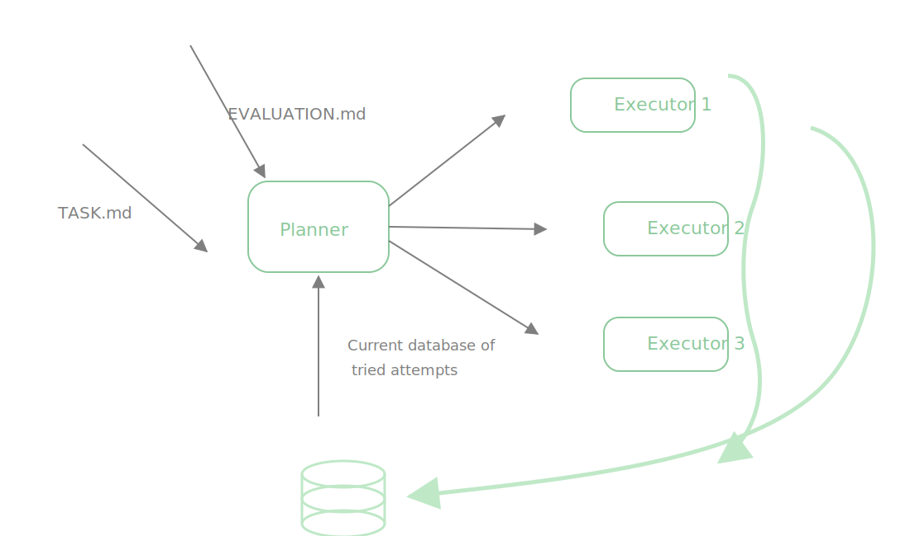

# autoresearch

This repo is organized around a planner/executor research loop:

- `TASK.md` defines the current research goal
- `EVALUATION.md` defines how each run is checked
- the planner reads those files plus prior run history
- the planner spawns or assigns executor agents
- executors write results, artifacts, and verdicts back into run history

